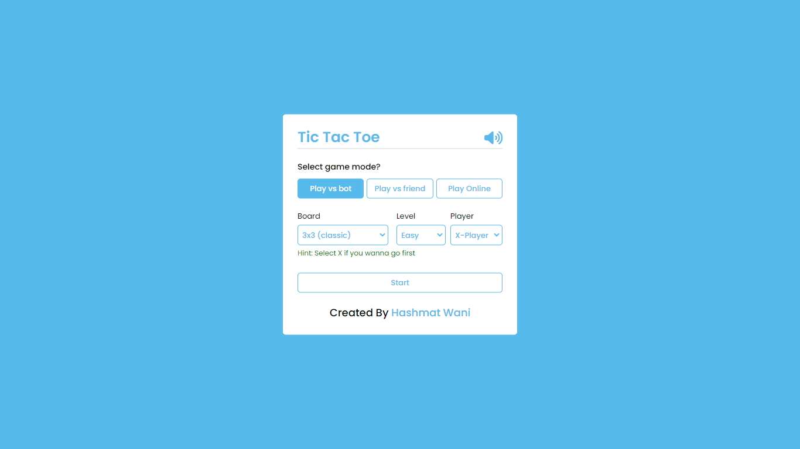
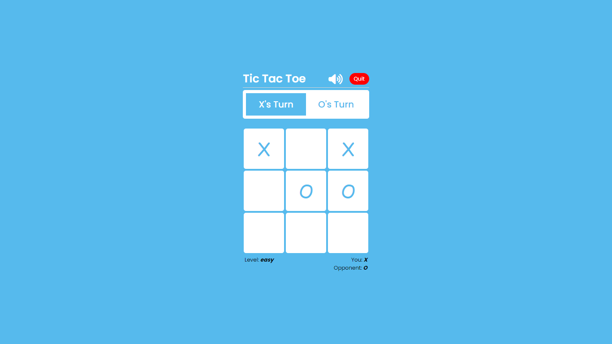
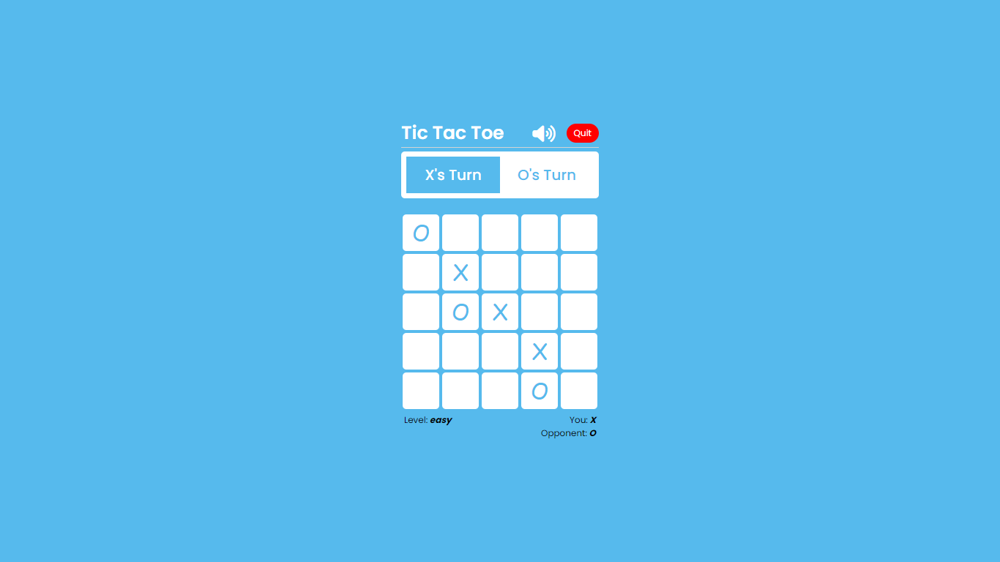
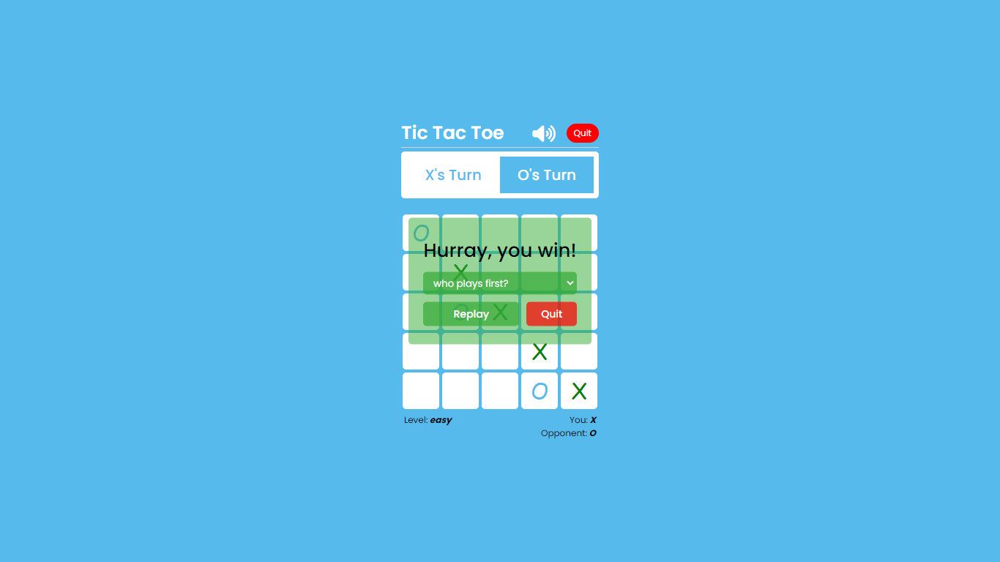
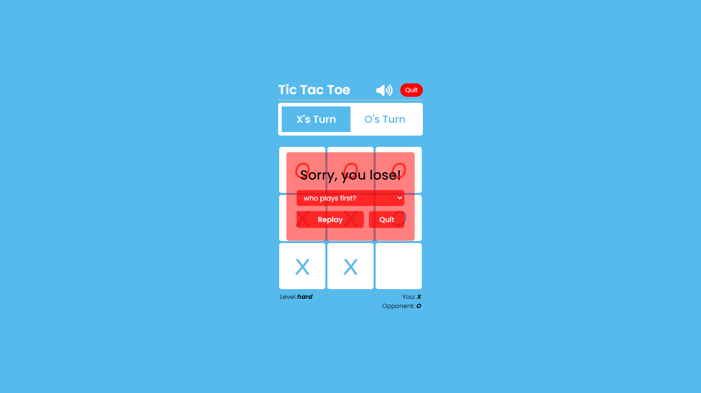

Tic-Tac-Toe is a game in which two players seek alternate turns to complete a row, a column, or a diagonal with either three O’s or three X’s drawn in the spaces of a grid of nine squares.

In our program or design [Tic Tac Toe Game], at first, on the webpage,

- There are three buttons which are labeled as **Play vs bot**, **Play vs friend**, and **Play online**. Users can select one option to continue the game, default is **Play vs bot**.

  - If user selects the **play vs bot**, then user will be having three options of level _easy, medium, hard_ default is easy. And user can also select then the Player **X or O**,

    - If the user selects the **X** then the bot will be **O** - _and first move will be played by user_. But if the user selects the **O** then the bot will be **X** - _and first move will be played by bot_.

  - If user selects the **Play vs friend**, then both the **moves** will be played by User.
  - User can also select board size between **3x3 and 5x5**.
    - In **3x3** user will be having an option of 3 levels **easy, medium, and hard**. But in **5x5**, user can only select between **easy and medium**.

After selecting all the options, User can start the game by clicking on a button **Start Game**. Once the user starts, the selection box will disappear and the playboard is visible. There are the player names at the top in the playboard section and it indicates or shows whose turn is now. At the center of the webpage, there is a tic tac toe play area with **9** or **25** square boxes (depends on user's selection). Once you click on the particular box then there is visible a sign or icon which you have chosen on the selection box.

Once you click on any box then after a couple of seconds the bot will automatically select the box which is not selected by you or the bot before, and the opposite icon is visible there means if your icon is **X** then the bot will have **O**. Once a match is won by someone, the result box appears with.

    * the winner sign and text.
    * Dropdown box to change the first turn.
    * A Replay and Quit button.

Once you click on the **Replay** button, the playboard will be restored and you can play again with the same settings. But, Once you click on the **Quit** button, the current page reloads and you've to select the options again.

If no one wins the match, the result box appears with **Tie Game!** and a replay and quit button. Once you click on the replay button, the current page reloads and you can play again.

Users can also **On/Off** Game audio by toggling the sound icon.

This game has 3 levels, **Easy, Medium, hard**.

- With the easy version, the **bot** chooses its move randomly.
- With the medium version, the bot chooses its move following some steps in order:
  - If a **bot** is at one move of winning, it chooses that move.
  - If the **player** is at one move of winning, it chooses that move.
  - Same as step 1, but if the bot is at two moves of winning.
  - Same as step 3, but with **player**.
  - Same as step 1, but if the bot is at three moves of winning.
  - Same as step 5, but with **player**.
  - **bot** goes for random move.
- With the hard version, I've implemented minimax algorithm
  - Like a professional chess player, this algorithm sees a few steps ahead and puts itself in the shoes of its opponent. It keeps playing ahead until it reaches a terminal arrangement of the board (terminal state) resulting in a tie, a win, or a loss. Once in a terminal state, the AI will assign an arbitrary positive score (+10) for a win, a negative score (-10) for a loss, or a neutral score (0) for a tie. At the same time, the algorithm evaluates the moves that lead to a terminal state based on the players’ turn. It will choose the move with maximum score when it is the AI’s turn and choose the move with the minimum score when it is the human player’s turn. Using this strategy, Minimax avoids losing to the human player.

# Home Page

# 3x3 Board

# 5x5 Board

# Result box - winning

# Result box - lose

